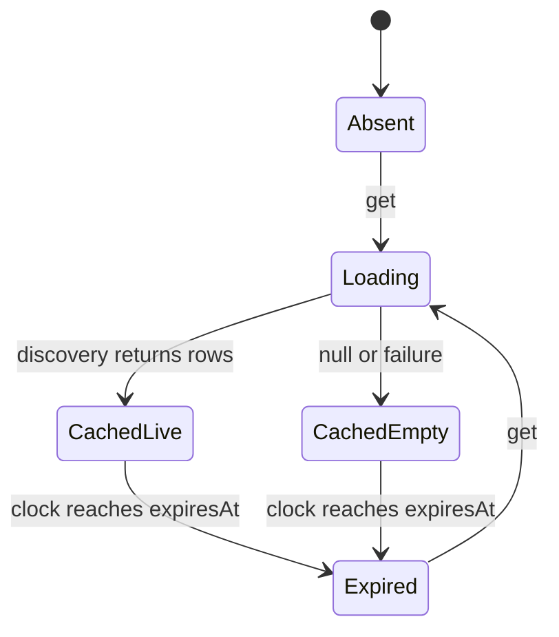

Spec ID: SPEC-JINI-AGENT-RUNTIME-STATE
Version: 2.0.0
Last Edited: 2026-10-03T04:10:53Z
Hash: sha256:873e531ed8695749c339b5404c85a7494e003b327099203326d96b5d5bb9d260
spec_mode: reverse_spec

# State Contract Spec: agent-runtime

## Ownership and persistence

| State owner | Lifecycle and identity | Persistence / cleanup |
|---|---|---|
| ModelCatalogCache instance | JSON-encoded string tuple → live catalog/null, expiry, in-flight promise | Memory only; entries retained until instance discarded; no invalidate/clear/eviction method |
| AmrModelLoadingCache instance; exported amrModelLoadingCache singleton | String key → last successful remote rows/time, shared in-flight refresh, last remote error | Memory only; resetForTests clears map but does not cancel outstanding loads |
| Remembered live model helpers | Agent ID plus optional trimmed scope → exact-ID set and ordered IDs | Module-global memory; subsequent remember replaces list; no TTL/public reset; labels reconstructed from IDs |
| agentCapabilities | Agent ID → discovered capability map | Public mutable module-global Map; help-probe work also single-flighted internally |
| Executable resolution configuration | Module-global env-variable-name overrides | Applies to later resolutions; configure at host bootstrap; not tenant-isolated |
| ACP probe seam | One active AcpModelProbe per module instance | setAcpModelProbe replaces collaborator; null restores no-op; no persistence |
| ElevenLabs voice cache | Workspace, normalized endpoint, clamped limit, SHA-256 credential fingerprint | Module-global successful-result cache; ten-minute TTL; no public eviction or single-flight guarantee |
| PendingAuthCache | OAuth state string → pending grant data | Delegates to @jini-ai/oauth memory cache; one-shot consume, TTL, pruning timer; stop cancels timer |
| OAuth token files | Caller dataDir/fileName → `{token?: StoredOAuthToken}` | Disk; write temp sibling, rename, best-effort chmod 0600; clear writes empty object when token exists |
| Callback listener | Bound → live → consuming callback/timeout/stop → stopped | In-memory consumed/stopped flags; clears timeout, closes server, reaps keep-alive sockets |
| RoleMarkerGuard / stream handlers | New per message/stream; buffered text, parser state and deduplication sets | Memory only; feed then flush; discard after stream; no durable replay |
| ACP / pi controllers | One attached child, one prompt turn | Protocol state in memory; durable upstream session ID/path returned for host to persist |
| Prepared prompt/log resources | One temporary directory per opted-in run | Disk; caller owns cleanup on every exit path; cleanup uses recursive force removal |
| Def runtimeLock | Host-held acquisition spanning buildArgs, spawn and child consumption of a shared settings-file side effect | In-process mutex; waitForHandoff or process exit releases hold; no distributed locking guarantee |

## Model catalog transitions

While discovery is in flight, concurrent reads for the same tuple await the same load even if its TTL has elapsed. TTL starts before discovery, so a slow discovery can be expired on completion. The first initiating call chooses its discovery override; later coalesced callers do not replace it. Each reader invokes merge with its own current fallback and cached live rows after waiting. Discovery failure discards prior live rows for this cache; no stale-live retention is promised. The tuple is copied before the asynchronous call; hosts must include every tenant/provider/credential scope that changes discovery in the key. Ports receive arrays by reference, so host merger/discovery implementations own their mutation behavior.

The legacy AMR cache behaves differently: cold get awaits preset discovery, starts remote refresh and returns preset; a warm get returns last remote rows immediately. Failed/empty remote refresh retains prior remote data and records remoteError. Expired entries can trigger another refresh immediately after a failed attempt; successful-refresh age, rather than a failure TTL, governs refresh eligibility. warm explicitly starts refresh even for a fresh entry; one in-flight refresh per key is shared.

## Authorization and token lifecycle

Pending state is consumed before provider-ID validation or token exchange. Failed validation/exchange cannot reuse the same state. A new flow is required. Pending cache stop does not constitute token revocation.

Token files hold one grant each and do not persist issuer/client configuration. Reads treat absent files as empty and malformed JSON as empty with a diagnostic; other I/O errors propagate. Writes serialize by the exact supplied dataDir/fileName strings inside one process. There is no cross-process lock, path canonicalization, encrypted storage or refresh single-flight. Host-chosen paths and configuration must consistently identify the account/provider.

resolveOAuthBearer reads lazily. An unexpired token returns source stored; an expired token with a refresh token is refreshed and persisted, returning source refreshed. A refresh response that omits refresh_token retains the stored refresh token. Failure returns null without deleting the old token. File clear is idempotent for a missing/empty token file.

## Session lifecycle

ACP initialization establishes a durable session ID, optionally selects the model and sends the prompt. Successful completion flushes suppression state, records completedSuccessfully, closes stdin and clears its stage timer. Failure marks fatal, emits an error and terminates the child. abort sends session/cancel if established, replies cancelled to pending permissions, closes stdin and clears the stage timer; the host owns signal escalation. Controller getters inspect state and do not await process exit. Native permission requests are deduplicated by request ID and passed to the host policy before reply.

pi optionally loads a parent session, waits for acknowledgement, then sends prompt. On agent_end it captures only a uniquely changed `.pi/sessions/*.jsonl` file relative to its initial snapshot, closes stdin and schedules termination after its grace period. Concurrent ambiguous changes return null. abort marks finished and sends the pi abort command; it does not close stdin or guarantee termination. The host owns signal escalation. The pi controller exposes fatal status and captured path; it has no completedSuccessfully method or turn watchdog. Neither attach function persists host chat history or spawns the supplied child.

JSON-line parsers accept feed({chunk}) and flush(); malformed/noisy input handling depends on the parser. No fixed maximum record size is enforced. SSE generator state exists only during iteration; it decodes UTF-8 chunks, joins data lines, ignores comments/id/retry and flushes a trailing record at EOF. It has no reconnect state.

Evidence: [cache tests](../../src/__tests__/model-catalog-cache.test.ts), [AMR cache](../../src/amr-model-cache.ts), [OAuth storage](../../src/providers/oauth-tokens.ts), [OAuth cache adapter](../../src/providers/pkce.ts), [session tests](../../src/agent-protocol/acp/__tests__/session.test.ts), [pi session](../../src/agent-protocol/pi-rpc/session.ts).
